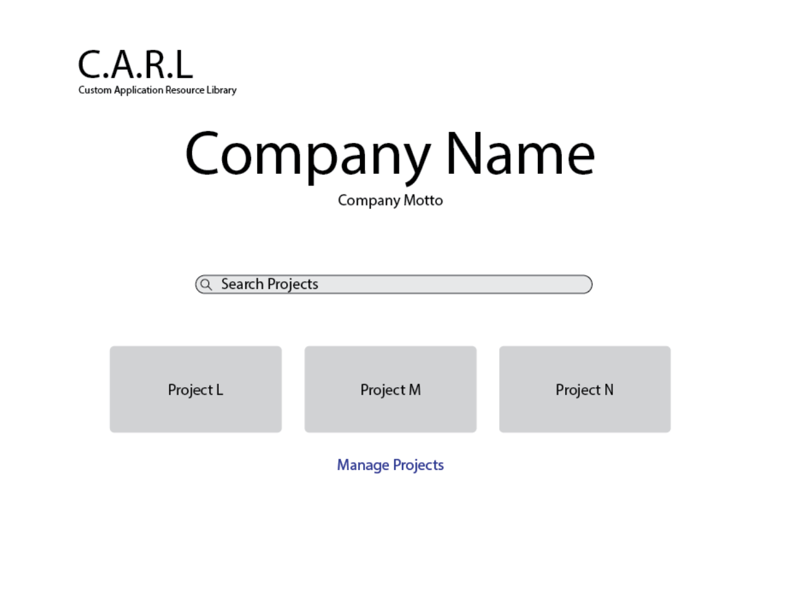
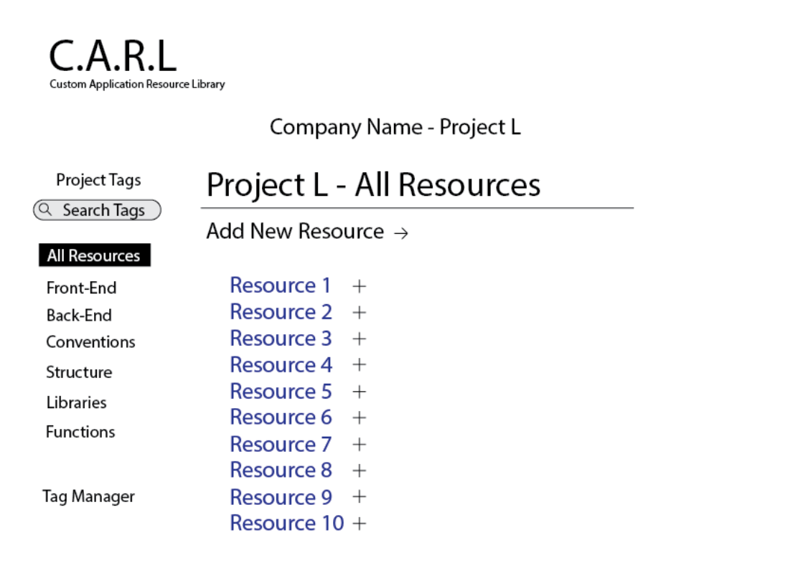
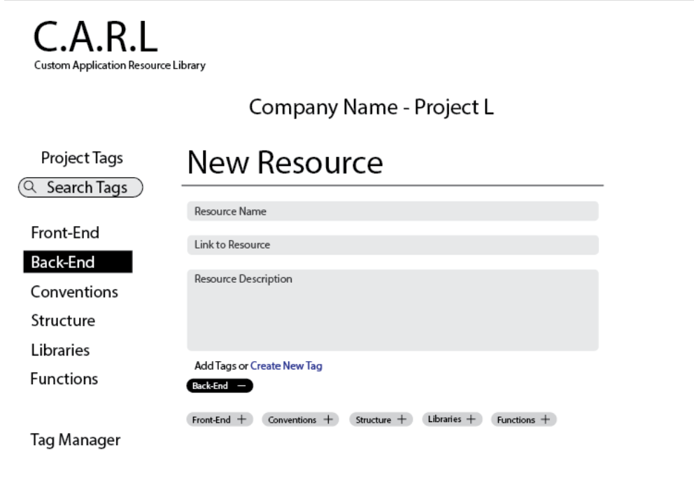
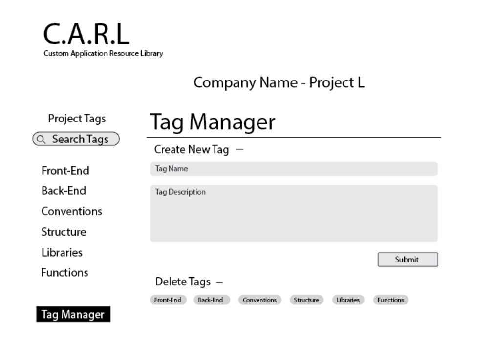

# Project Milestone 4: Web Pages Design
This document provides descriptions of each page in our web application.

This includes a description, necessary parameters, data and links needed to make our pages functional and the tests that will ensure proper functionality of our web application.

### Home Page

#### Description:
The home page will provide fields for the user to input their login credentials, once the user is logged in all of their projects will be displayed. The user can choose the project they wish to view by clicking on the project. This will take them to the title page for the project described as the Resource Page.
#### Parameters: 
The parameters that will be passed to the back-end from this page are the user inputs for log-in credentials. Once they are verified, the page will update with the relevant projects associated with the user. The parameters passed to the front-end after this verification will include an array containing the list of projects that this user owns or is allowed access to.
#### Data:
- Access to login credentials database
- Users Projects
#### Links:
Once the user is logged in, their projects must have active links to take them to the resource page matching the project.
#### Testing:
We will use the the testing libraries available through the flask testing libraries to ensure that our page renders correctly. Tests will include:
- Test to ensure input from the user is passed to the back-end
- Test to ensure the successful redirect to the user's project page upon successful login.
- Test to ensure that the project page renders only the data associated with the authenticated and authorized user. 
### Add Projects Page

#### Description:
The user will be able to add a project to their account. This project will have a unique title, description and hold its own resources and tags.
#### Parameters:
This page takes in user input regarding the title, description, resources and tags associated with the project and passes it to the back-end for storage. Once completed, the page will redirect to the newly created project for review. This requires the page to handle a parameter for the project page. 
#### Data:
- A project holds all tags and resources. A newly created projects will need its own place to store resources and tags.
- The new projects must be added to the user's projects and have a functionality to check if the project title already exists.
#### Links:
After a project is created, a link to that project will be generated for quick access for the user.
#### Testing:
We will implement the following tests:
- Test to make sure that the form submission data is passed to the back-end
- Test to make sure there is a successful redirect upon submission of a project
- Test to make sure that the redirect to the project page renders the data submitted by the user correctly
### Resources Page

#### Description:
All resources associated with the current project are displayed in a table with a title, description and a link to the resource. A search functionaity will provided to search for a resource by its title.
#### Parameters:
The resources page takes in a resource id parameter to redirect users to a specific resource when queried. Additionally, the page handles parameters for customer searches of resources, and passes them to the back-end to conduct a search. The results of this search are returned as a parameter back to the page to render the resources that were returned from the search.
#### Data:
Access to the resources associated with current project only and their associated tags is necessary for this page.
#### Links:
If a user wants to understand why a resource has a certain tag. Each tag will provide a pop-up description of its intended use when selected.
#### Testing:
We will implement the following tests:
- Test to ensure that when a user searches for a resource, the query is appropriately passed to the back-end
- Test to ensure that when a user searches for a resource, the page renders only the relevant resources
- Test to ensure that when a user selects to view a single resource, that the page redirects to that single resource by resource id.
### Add Resources Page

#### Description:
The user can create a new resource by giving it a title, supplying the link, adding a description and applying any previously existing tags to the new resource. 
#### Parameters:
This page takes in information from the user to create a resource. Additionally, the page requires input from the back-end to render the tags selection, to ensure users can only tag resources with existing tags. The page will pass title, link, description, and tag information to the back-end for storage. Once a user successfully creates a new resource, the page will take in a parameter for the newly created resource id and redirect to the resources page so the user can view their newly created resource.
#### Data:
- The user must have the ability to add any tags assciated with the project to the new resource.
- The new resource must be added to it's specified project and have a functionality to check if the resource already exists.
#### Links:
If a user wants to understand the purpose of a tag when deciding to assign it to a resource. Each tag will provide a pop-up description of its intended use when selected.
#### Testing:
We will implement the following tests:
- Test to make sure that the form takes in the user's inputs and passes them to the back-end appropriately
- Test to make sure that the page redirects to the resources page upon successful storage of the resource and renders the newly created resource correctly
- Test to make sure that the tag information is rendered correctly from the back-end.

### Tag Manager

#### Description:
- The user can view all tags and tag descriptions associated with the current project.
- The user can create a new tag by giving it a title and adding a description.
- The user can search a tag and find all resources associated with that tag.
#### Parameters:
This page will take in parameters from the back-end including data about the tags and their associated projects. the page will also take in input from the user to generate a new tag, including title and description informaiton, and pass it to the back-end. The page will handle input from the back-end when that tag is successfully created to show the new tag. Finally, the page will handle input from the user to query existing tags, and handle input from the back-end consisting of the results of the user submitted search.
#### Data:
- The tag manager must have acccess to all tags associated with the current project, their descriptions and some information about the resources they are tagged to.
- The newly created tag must be added to it's specified project and have a functionality to check if the tag already exists.
#### Links:
All active tags will be displayed on the page with links to a table of the resources with which they are associated.
#### Testing:
We will implement the following tests:
- Test to make sure that the page handles and renders the tag data appropriately, only showing tags that exist
- Test to make sure that the page takes in input from the user and passes those parameters to the back-end to query existing tags
- Test to make sure that query results are appropriately rendered given the response from the back-end on matching results
- Test to make sure that form data is handled correctly and passed to the back-end
- Test to make sure that when a user creates a new tag, that the page succesfully refreshes and shows the newly created tag.
