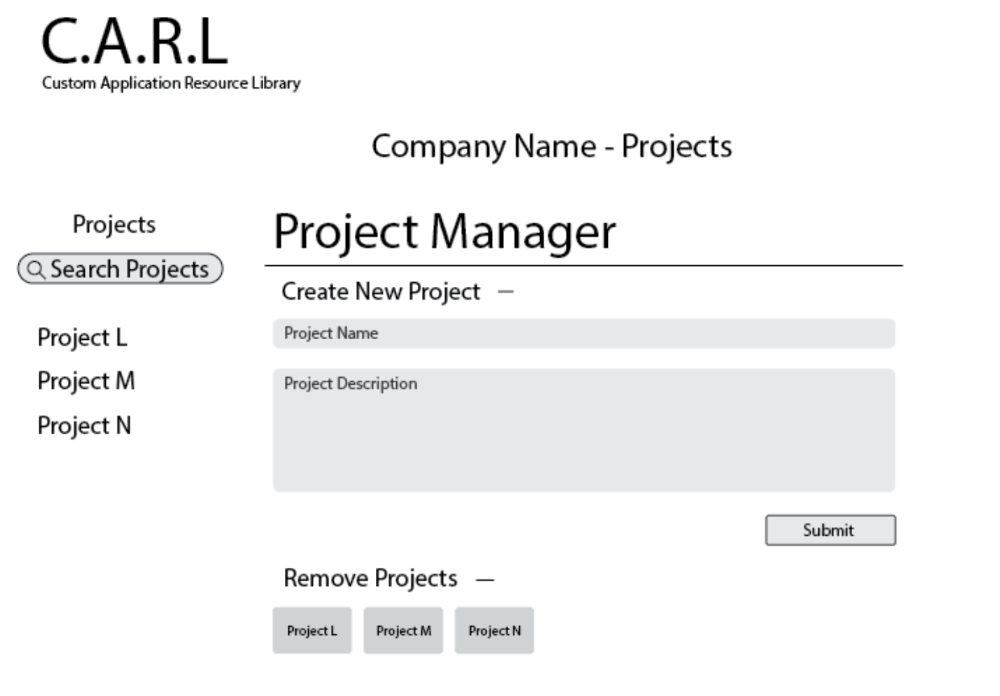

# Project Milestone 4: Web Pages Design
This document provides descriptions of each page in our web application.

This includes a description, necessarry parameters, data and links needed to make our pages functional and the tests that will ensure proper functionality of our web application.

### Home Page

#### Description:
The home page will provide feilds for the user to inout their login credentials, once the user is logged in all of their projects will be displayed. The user can choose the project they wish to view by clicking on the project. This will take them to the title page for the project described as the Resource Page.
#### Parameters:

#### Data:
- Access to login credentials database
- Users Projects
#### Links:
Once the user is logged in, their projects must have active links to take them to the resource page matching the project.
#### Testing:

### Add Projects Page

#### Description:
The user will be able to add a project to their account. This project will have a unique title, description and hold its own resources and tags.
#### Parameters:
#### Data:
- A project holds all tags and resources. A newly created projects will need its own place to store resources and tags.
- The new projects must be added to the user's projects and have a functionality to check if the project title already exists.
#### Links:
After a project is created, a link to that project will be generated for quick access for the user.
#### Testing:
### Resources Page

#### Description:
All resources associated with the current project are displayed in a table with a title, description and a link to the resource. A search functionaity will provided to search for a resource by its title.
#### Parameters:
#### Data:
Access to the resources associated with current project only and their associated tags is necessary for this page.
#### Links:
If a user wants to understand why a resource has a certain tag. Each tag will provide a pop-up description of its intended use when selected.
#### Testing:
### Add Resources Page

#### Description:
The user can create a new resource by giving it a title, supplying the link, adding a description and applying any previously existing tags to the new resource. 
#### Parameters:
#### Data:
- The user must have the ability to add any tags assciated with the project to the new resource.
- The new resource must be added to it's specified project and have a functionality to check if the resource already exists.
#### Links:
If a user wants to understand the purpose of a tag when deciding to assign it to a resource. Each tag will provide a pop-up description of its intended use when selected.
#### Testing:

### Tag Manager

#### Description:
- The user can view all tags and tag descriptions associated with the current project.
- The user can create a new tag by giving it a title and adding a description.
- The user can search a tag and find all resources associated with that tag.
#### Parameters:

#### Data:
- The tag manager must have acccess to all tags associated with the current project, their descriptions and some information about the resources they are tagged to.
- The newly created tag must be added to it's specified project and have a functionality to check if the tag already exists.
#### Links:
All active tags will be displayed on the page with links to a table of the resources with which they are associated.
#### Testing: