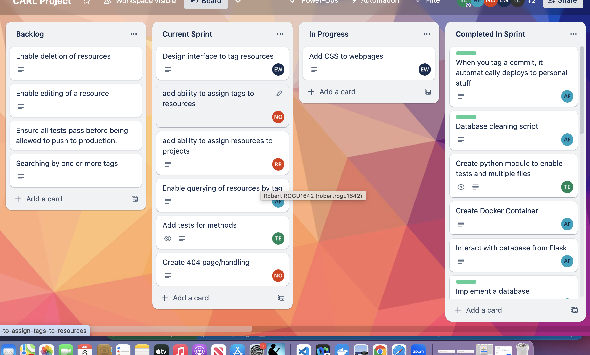
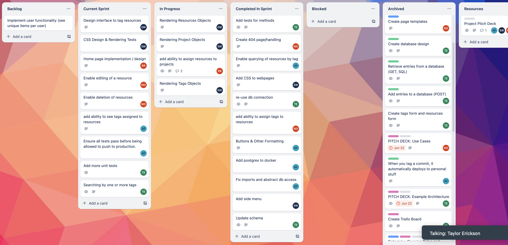
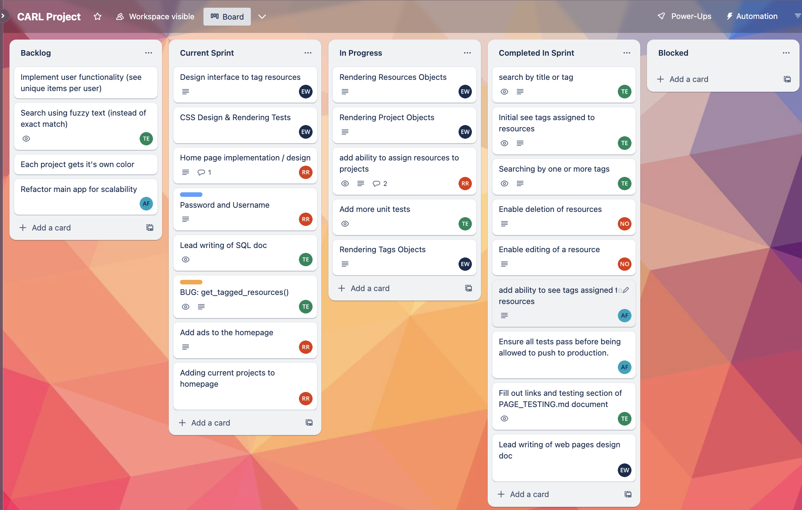
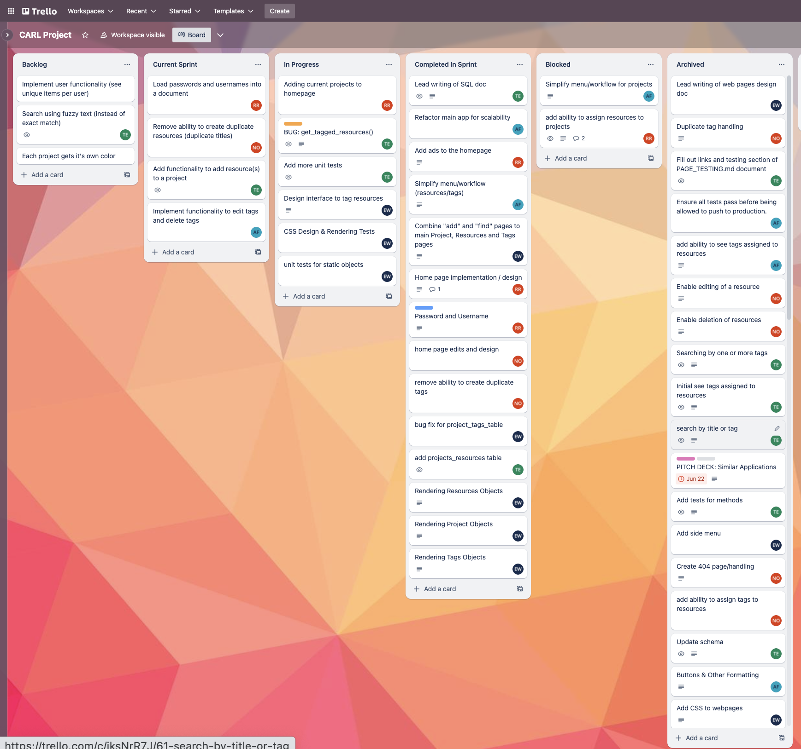
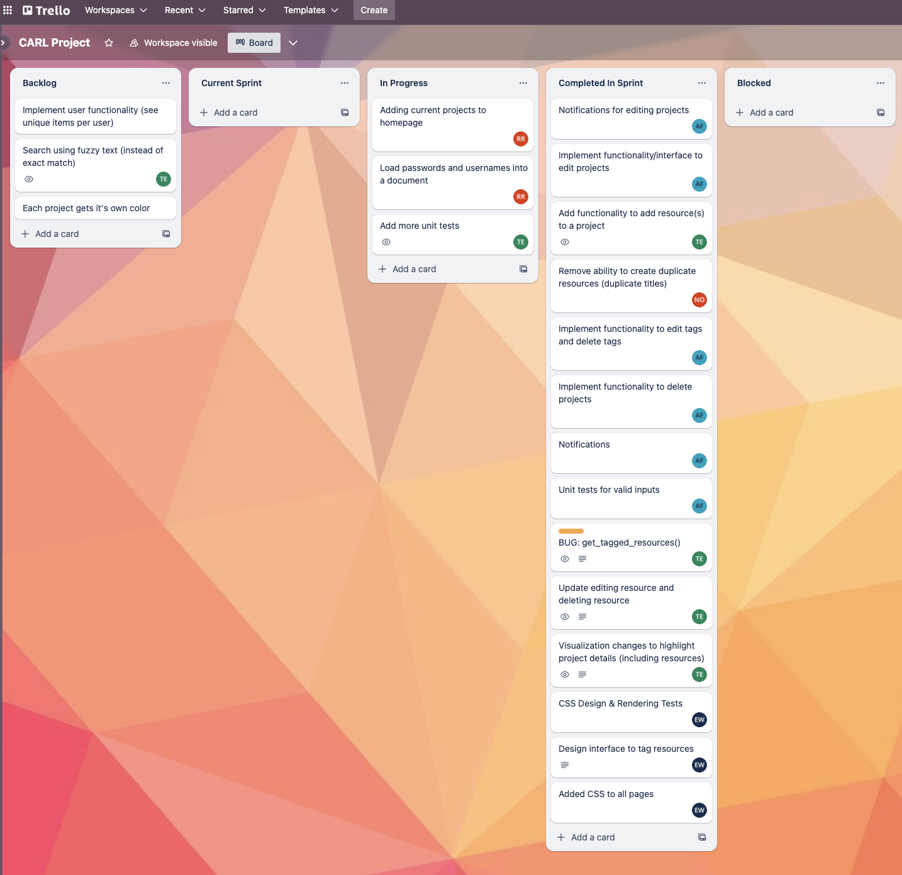

# Weekly Status Updates
This document contains weekly status updates on project progress. 

Each week includes a screenshot of our Trello board and some additional comments to add context and detail. 

### Week 6 (June 26 - July 2)

| Task          | Status             |  Developer(s)   | Trello Link   |
|---------------|--------------------|-----------------|---------------|
| Auto-deploy   | Complete           | Adam Fowler     | https://trello.com/c/ajdFgyUi |
| Create Docker Container | Complete | Adam Fowler | https://trello.com/c/jFDVitCv |
| Prototype Database Integration with Flask | Complete | Adam Fowler | https://trello.com/c/1mWj9uwo |
| Create Hello World Database | Complete | Adam Fowler | https://trello.com/c/qwcwn7jt |
| Create Hello World Flask Server | Complete | Adam Fowler | https://trello.com/c/61OXqLJ1 |
| Create Form page | Complete | Taylor Erickson | https://trello.com/c/hEIUtrXg |
| Add Tags and Resources Forms | Complete | Taylor Erickson | https://trello.com/c/3RTjvwbG |
| Add entries to database | Complete | Taylor Erickson | https://trello.com/c/pFHiXUL9 |
| Retrieve entries from database | Complete | Taylor Erickson | https://trello.com/c/P6mtUjLz |
| Create database design | Complete | Taylor Erickson | https://trello.com/c/7wiaX2CA |
| Create page templates | Complete | Nolan Ollada | https://trello.com/c/PAUznisv |
| Organize route structure | Complete | Nolan Ollada | https://trello.com/c/DLRvr5Rs |
| Handle empty tables | Complete | Adam Fowler | https://trello.com/c/lt8y3qsO |
| Database cleaning | Complete | Adam Fowler | https://trello.com/c/XzvR1IMw |
| Create Python module & unit tests | Complete | Taylor Erickson | https://trello.com/c/M02iKGTK |
| Add input sanitation to all user supplied data | Complete | Adam Fowler | https://trello.com/c/OSxIlz0P |
| Design Interface to Tag Resources | In Progress | Emily White | https://trello.com/c/9sj2ZqtC |

This next week, we will focus on implementing additional functionality to assign resources and tags, as well as additional APIs, testing and front-end development. 

### Week 7 (July 3 - July 9)

| Task          | Status             |  Developer(s)   | Trello Link   |
|---------------|--------------------|-----------------|---------------|
| Query resources by tag | Complete | Adam Fowler | https://trello.com/c/VTk73fRv |
| Mocking of postgres & initial unit tests | Complete | Taylor Erickson | https://trello.com/c/bKFoE2gY |
| Refactor to establish one database connection | Complete | Taylor Erickson | 
| Buttons and other formatting | Complete | Adam Fowler | https://trello.com/c/ryDtSnZS |
| Add tags to resources | Complete | Nolan Ollada | https://trello.com/c/uHoa1wFC |
| Add 404 page handling | Complete | Nolan Ollada | https://trello.com/c/bs2gcRLd |
| Add postgres to docker | Complete | Adam Fowler | https://trello.com/c/2K3xHOo3 |
| Fix imports and abstract db access | Complete | Adam Fowler | https://trello.com/c/JUI4HFlq |
| Add styling to templates | Complete | Emily White | https://trello.com/c/V6NVvkJB |
| Add side-bar menu | Complete | Emily White | https://trello.com/c/Spma6PXg |
| Rendering project objects | In-Progress| Emily White | https://trello.com/c/DSmlnZYX |
| Rendering resource objects | In-Progress | Emily White | https://trello.com/c/DdKCNWpf |
| Rendering tags objects | In-Progress | Emily White | https://trello.com/c/gGxrHPng |
| Update schema | Complete | Taylor Erickson | https://trello.com/c/WgI8o9jO |
| Add resources to a project | In-Progress | Robert Gunn | https://trello.com/c/upYTVUFb |

In the next week, we will be doing the following:

design interface to tag resources - emily

css design and rendering tests - emily

home page implementation - robert

enable editing & deletion of a resource - nolan

see tags assigned to resources - adam

ensure all tests pass prior to production - adam

add more unit tests - taylor

search by one or more tags - taylor

### Week 8 (July 10 - July 16)

| Task          | Status             |  Developer(s)   | Trello Link   |
|---------------|--------------------|-----------------|---------------|
| Search by title or tag | Complete | Taylor Erickson | https://trello.com/c/jksNrR7J |
| Initial see tags assigned to resources | Complete | Taylor Erickson | https://trello.com/c/fxCrftmO |
| Search by one or more tags | Complete | Taylor Erickson | https://trello.com/c/ZsljTaP9 |
| Add tests, parameters to web page design | Complete | Taylor Erickson | https://trello.com/c/xpc1R3wL |
| Add more unit tests | In progress | Taylor Erickson | https://trello.com/c/GqducP0V |
| Enable deletion of resources | Complete | Nolan Ollada | https://trello.com/c/WX3gS7cc |
| Enable editing of a resource | Complete | Nolan Ollada | https://trello.com/c/Ezy1JVW5 |
| Add ability to see tags assigned to resoures | Complete | Adam Fowler | https://trello.com/c/zGc4lldQ |
| Ensure all tests pass before production | Complete | Adam Fowler | https://trello.com/c/uTKmMvlH |
| Lead writing of web pages design doc | Complete | Emily White | https://trello.com/c/AUzjXYC4 |
| Rendering resources objects | In progress | Emily White | https://trello.com/c/DdKCNWpf |
| Rendering project objects | In progress | Emily White | https://trello.com/c/DSmlnZYX |
| Rendering tags objects | In progress | Emily White | https://trello.com/c/gGxrHPng |
| Design interface to tag resources | In progress | Emily White | https://trello.com/c/9sj2ZqtC |
| CSS design and rendering tests | In progress | Emily White | https://trello.com/c/44KYG8re | 
| Add ability to assign resources to projects | In progress | Robert Gunn | https://trello.com/c/upYTVUFb |
| Home page implementation and design | In progress | Robert Gunn | https://trello.com/c/P1vSqGuT |
| Implement password and username | In progress | Robert Gunn | https://trello.com/c/uwkklm9v |

In the next sprint, we're going to focus on:

Emily White: 
- ongoing items
- HTML & CSS tests

Robert Gunn:
- ongoing items
- add ads to homepage
- add current projects to homepage

Nolan Ollada:
- Unit tests for assigning tags to resources

Adam Fowler:
- refactor main app for scalability
- combine multiple pages to a few pages to improve the user experience

Taylor Erickson:
- get_tagged_resources() bug
- lead SQL design doc

### Week 9 (July 17 - July 23)

| Task          | Status             |  Developer(s)   | Trello Link   |
|---------------|--------------------|-----------------|---------------|
| Lead writing of SQL design doc | Completed | Taylor Erickson | https://trello.com/c/Yo0WiIbX |
| Add projects_resources table | Completed | Taylor Erickson | https://trello.com/c/PMI3JVWJ |
| Fix get_tagged_resources() bug | In progress | Taylor Erickson | https://trello.com/c/MbCMu4g0 |
| Add more unit tests | In progress | Taylor Erickson | https://trello.com/c/GqducP0V |
| Bug fix for projects_tags table | Completed | Emily White | https://trello.com/c/Wl7Y9hr1 |
| Combine add and find pages to main project Project, Resources, and Tags pages | Completed | Emily White | https://trello.com/c/Nb6qOfWg |
| Rendering tags objects | Completed | Emily White | https://trello.com/c/gGxrHPng |
| Rendering project objects | completed | Emily White | https://trello.com/c/DSmlnZYX |
| Rendering resources objects | Completed| Emily White | https://trello.com/c/DdKCNWpf |
| Design interface to tag resources | In progress | Emily White | https://trello.com/c/9sj2ZqtC |
| CSS Design & Rendering Tests | In progress | Emily White | https://trello.com/c/44KYG8re |
| Unit tests for static ojbects| In progress | Emily White | https://trello.com/c/beUu0tC9 |
| Home page implementation and design | Completed | Robert Gunn | https://trello.com/c/P1vSqGuT |
| Password and username | Completed | Robert Gunn | https://trello.com/c/uwkklm9v |
| Add ads to the homepage | Completed | Robert Gunn | https://trello.com/c/5X4Qvdol |
| Add current projects to homepage | In progress | Robert Gunn | https://trello.com/c/TCLUexo1 |
| Refactor main app for scalability | Completed | Adam Fowler | https://trello.com/c/3YAh3h0l |
| Simplify menu/workflow (resources/tags) | Completed | Adam Fowler | https://trello.com/c/GTLuWneE |
| Home page edits and design | Completed | Nolan Ollada | https://trello.com/c/uy5d4lHc |
| Remove ability to create duplicate tags | Completed | Nolan Ollada | https://trello.com/c/j4HByQTv |

In the next sprint, we're going to work on:

Emily White: 
- Design interface to tag resources
- CSS design and rendering tests
- unit tests for static objects

Robert Gunn:
- Load all of the passwords and usernames into a document 

Nolan Ollada:
- Remove ability to create duplicate resources

Adam Fowler:
- implement functionality to edit tags and delete tags

Taylor Erickson:
- complete work on get_tagged_resources() bug
- add functionality to add a resource to a project 
- continue adding more unit tests

### Week 10 (July 24 - July 30)

| Task          | Status             |  Developer(s)   | Trello Link   |
|---------------|--------------------|-----------------|---------------|
| Notifications for editing projects | Completed | Adam Fowler | https://trello.com/c/WQA28qdX |
| Implement functionality/interface to edit projects | Completed | Adam Fowler| https://trello.com/c/wNf9iVL4|
| Implement functionality to edit tags and delete tags | Completed | Adam Fowler | https://trello.com/c/DSnsCDLD| 
| Notifications | Completed | Adam Fowler |https://trello.com/c/yMKe8Pga |
| Unit tests for valid inputs | Completed | Adam Fowler | https://trello.com/c/3hf6mmrn| 
| Remove ability to create duplicate resources (duplicate titles) | Completed | Nolan Ollada | https://trello.com/c/euaRVSlR |
| Added CSS to all pages | Completed | Emily White | https://trello.com/c/8gnK3FzF|
| Design interface to tag resources | Completed | Emily White |https://trello.com/c/9sj2ZqtC |
| CSS design and rendering tests | Completed | Emily White | https://trello.com/c/44KYG8re|
| Adding current projects to homepage | In progress | Robert Gunn | https://trello.com/c/TCLUexo1|
| Load passwords and usernames into a document | In progress | Robert Gunn | https://trello.com/c/Xf0QJqOB | 
| Add functionality to add resource(s) to a project | Completed | Taylor Erickson | https://trello.com/c/Ibo5igoC|
| BUG: get_tagged_resources() | Completed | Taylor Erickson | https://trello.com/c/MbCMu4g0|
| Updating editing resource and deleting resource | Completed | Taylor Erickson | https://trello.com/c/cpOPyEtb|
| Visualization changes to highlight project details (including resources) | Completed | Taylor Erickson |https://trello.com/c/psr9iKVG |

For our remaining sprint, our goals are to make any final bug fixes and edits and start preparing our presentation and demo. 

### Week 11 (July 31 - August 6)

### Week 12 (August 7 - August 13)

### Week 13 (August 14 - August 20)
